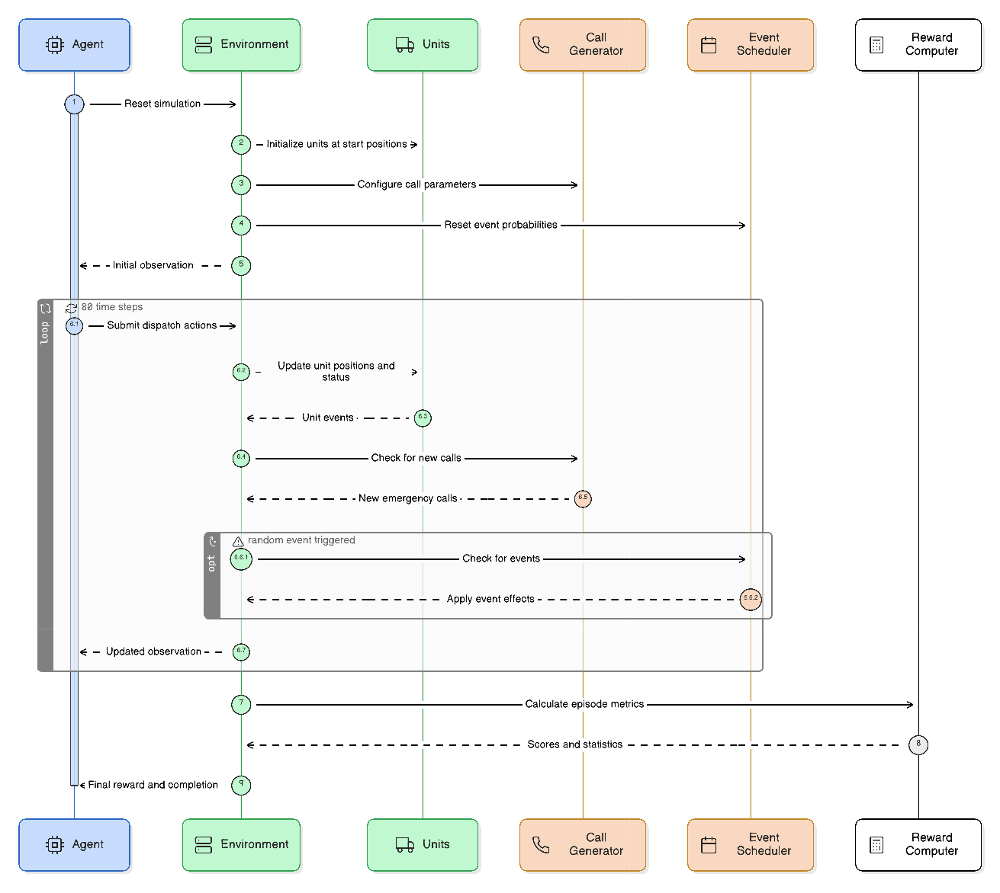
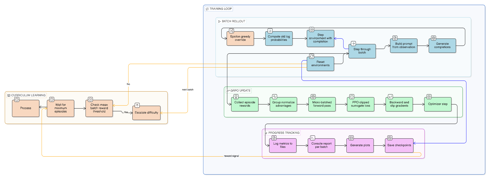
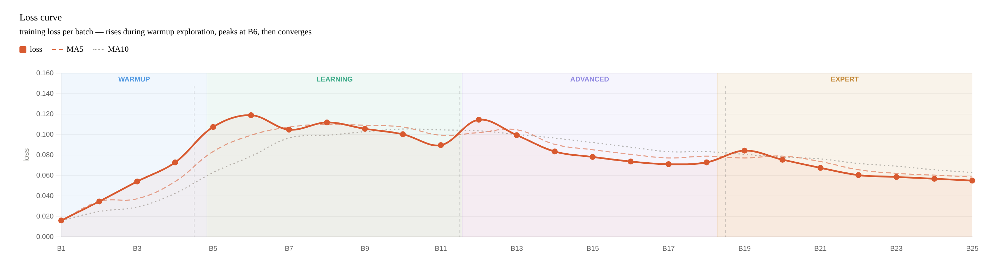
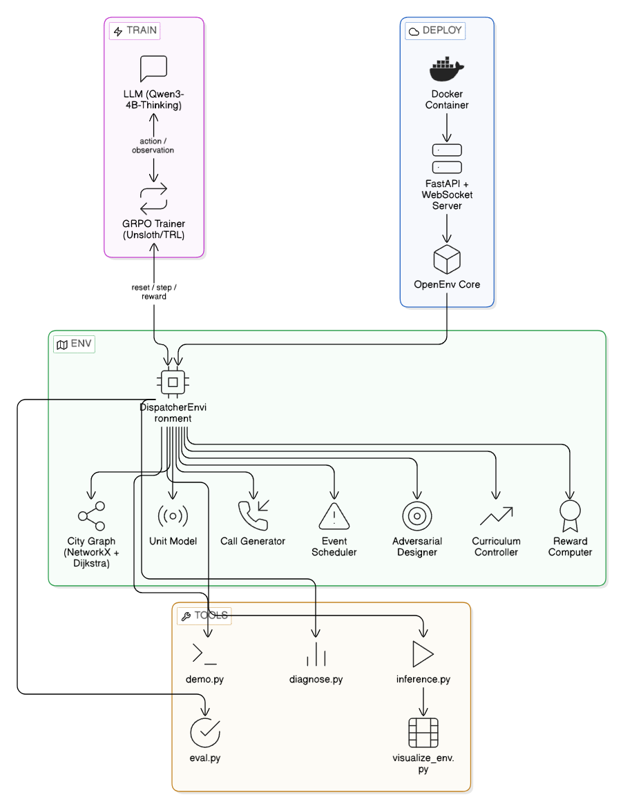

# DispatchR
### Training an RL Agent for Emergency Dispatch Under Uncertainty

<i>What happens when an AI has to make decisions where every mistake costs a life?</i>

---

## Introduction

Emergency dispatch is not a clean optimization problem.

Information is incomplete. Signals are unreliable. The situation changes while decisions are being made.

We wanted to build an environment where an agent has to deal with all of this at once, not just react, but reason.

That is how **DispatchR** came together.

---

## The Scenario

It is 2:47 AM.

Three calls come in at the same time.

- A cardiac emergency downtown, the caller is panicking
- A fire on the highway, a unit was already sent, but the radio has gone silent
- A calm call from the suburbs, "my husband feels unwell"

You have limited units. Some are busy. Some might not be where you think they are.

And you do not know which call is actually critical.

---

## What We Built

DispatchR is a reinforcement learning environment for emergency dispatch.

Instead of a static task, the agent operates inside a dynamic system:

- Multiple simultaneous calls
- Limited resources
- Hidden severity
- Delayed information
- City-wide disruptions
- Adversarial signals like fake emergency calls

The goal is simple: respond effectively without causing fatalities.

---

## The Environment

  

<i>20-node city divided into operational zones</i>

### Why this is hard

- Calls arrive randomly
- True severity is hidden
- Unit positions may be outdated
- Events change travel conditions and increase routing pressure

The agent does not have perfect information about the world state.

---

## Episode Structure

  

Each episode runs for 80 steps.

At every step:
- Calls arrive
- Units move
- Events trigger
- The agent acts

The main episode score is computed at the end.

---

## Action Space

The agent can:

- **Dispatch** units
- **Reroute** in-flight units
- **Stage** for coverage
- **Verify** suspicious calls
- **Request support**
- **Hold**

Each decision affects future outcomes.

---

## Reward Design

  

We optimize for:

- **Response quality (50%)**
- **Fatalities (30%)**
- **Coverage (20%)**

Most of the reward signal comes from the final episode outcome.

We also use small shaping terms during rollout to discourage obviously bad behavior, such as invalid actions or holding when urgent calls are waiting. That makes early training less degenerate without changing the main objective.

---

## Preventing Reward Hacking

Agents will exploit any shortcut they find.

We had to prevent:

| Bad Strategy       | Why it fails |
|--------------------|--------------|
| Holding forever    | Penalized by idle cost and weak final outcomes |
| Clustering units   | Coverage drops across zones |
| Chasing fake calls | No response benefit, plus opportunity cost |

  

---

## Training

  

We trained using **GRPO (Group Relative Policy Optimization)**.

Setup:
- Qwen3-4B
- LoRA fine-tuning
- Epsilon-greedy exploration

Early challenge: the model did nothing.
Exploration was necessary to start learning.

---

## Curriculum Learning

Training the agent directly on the hardest scenarios did not work.

With too many calls, false alarms, and disruptions early on, the agent failed to learn anything meaningful. It either hesitated or made random decisions without improving.

To address this, we introduced **curriculum learning**, gradually increasing difficulty as the agent improves.

---

### How It Works

We divide training into phases:

| Phase     | Calls per Episode | False Alarms | Events     | Complexity |
|-----------|-------------------|--------------|------------|------------|
| Warmup    | Low (~3)          | 0%           | None       | Very low   |
| Learning  | Moderate (~5)     | 10%          | Few        | Medium     |
| Advanced  | High (~8)         | 15%          | Frequent   | High       |
| Expert    | Very high (~12)   | 20%          | Aggressive | Very high  |

---

### Progression Logic

- If the agent performs well, move to a harder phase
- If performance drops, reduce difficulty
- This creates a feedback loop between learning and environment complexity

---

### Why This Matters

Without curriculum learning:

- The agent faces too much randomness early
- Rewards remain near zero
- No meaningful policy emerges

With curriculum learning:

- The agent first learns basic dispatch
- Then learns prioritization
- Then adapts to uncertainty and disruptions

---

### Intuition

> Learn to walk before you run.

Instead of solving the hardest problem immediately, the agent builds capability step by step.

---

  

<i>Increasing environment complexity as the agent improves</i>

---

## Learning Progress

  

  

Training progression:

- Early: hesitation, missed calls
- Mid: correct dispatch, better coverage
- Later: more consistent prioritization under pressure

The agent begins to handle uncertainty instead of reacting blindly.

---

## Behavior Shift

One of the clearest signs of learning was not a single dramatic episode. It was a repeated change in behavior across evaluation runs.

Instead of publishing raw traces, we summarize the pattern we saw:

| Situation | Early behavior | Later behavior |
|-----------|----------------|----------------|
| Multiple calls arrive together | Hesitates or holds too long | Commits earlier to the highest-priority case |
| Critical vs nearby low-priority case | Overweights proximity | Prioritizes severity more reliably |
| Coverage after dispatch | Leaves zones thin | Preserves reserve coverage more often |
| Suspicious or noisy signals | Reacts too literally | Handles ambiguity more cautiously |

This section is intentionally presented as a qualitative summary rather than a verbatim log dump. The goal is to show the behavioral delta without exposing full internal traces or cluttering the write-up with raw rollout data.

---

## Why This Matters

This environment introduces:

- Partial observability
- Long-horizon planning
- Adversarial signals
- Real-world uncertainty

These are not toy constraints. They are the kinds of pressures that make coordination problems hard in practice.

---

## Technical Overview

  

- Custom RL environment
- GRPO-based training
- Hugging Face integration
- Simulation-first design

---

## What's Next

- Stronger replay and analysis tooling on top of the existing episode export and visualization pipeline
- Multi-agent coordination
- Real-world data integration
- Larger environments

---

## Final Thoughts

The most interesting part was not just what we programmed.

It was what the training setup started to encourage:

- More decisive prioritization
- Better handling of uncertainty
- Less obviously wasteful behavior

That is the real point of the project. Not that the agent is solved, but that the environment is rich enough to expose whether useful behavior is emerging at all.

---

## References

- TRL documentation for `GRPOTrainer`
- Sutton and Barto, *Reinforcement Learning: An Introduction*
- Qwen model documentation
- OpenEnv hackathon materials

---

## Acknowledgements

Built during the Meta PyTorch OpenEnv Hackathon.

